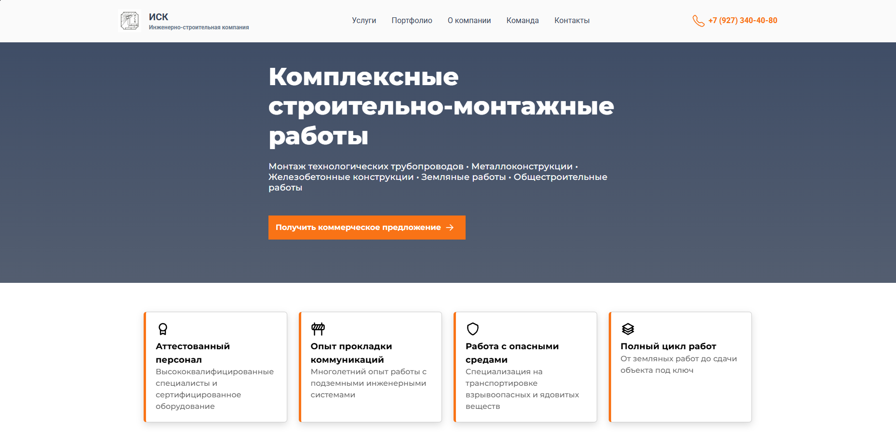
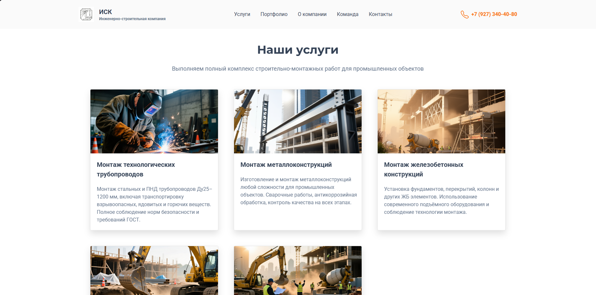
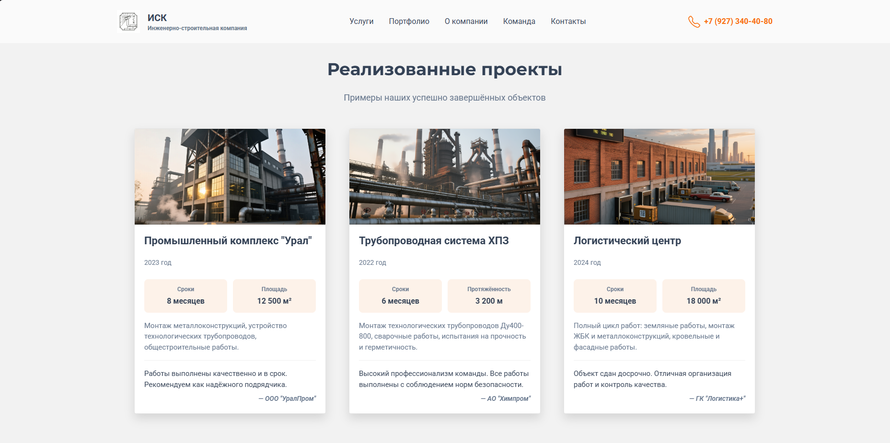
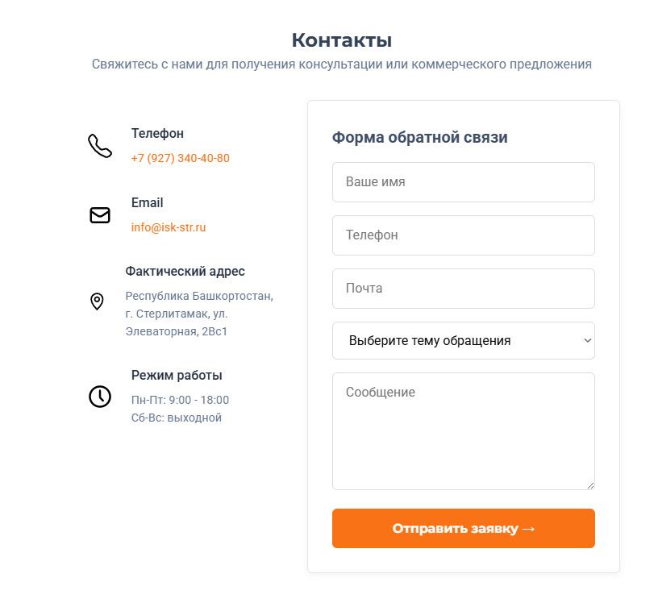
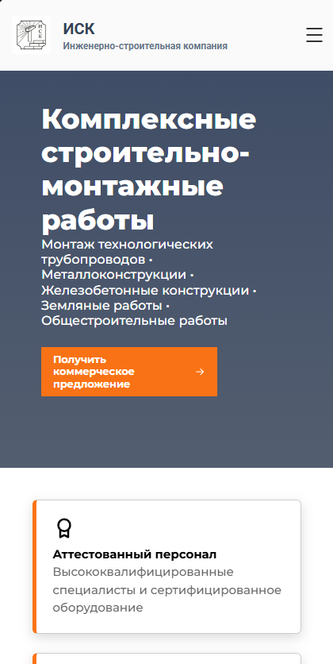
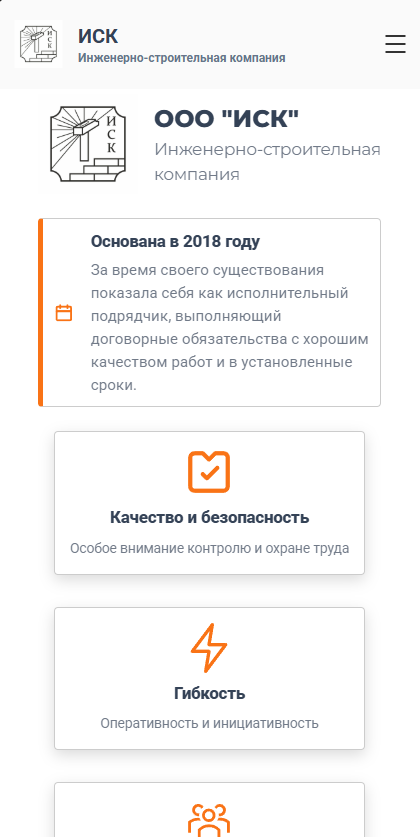
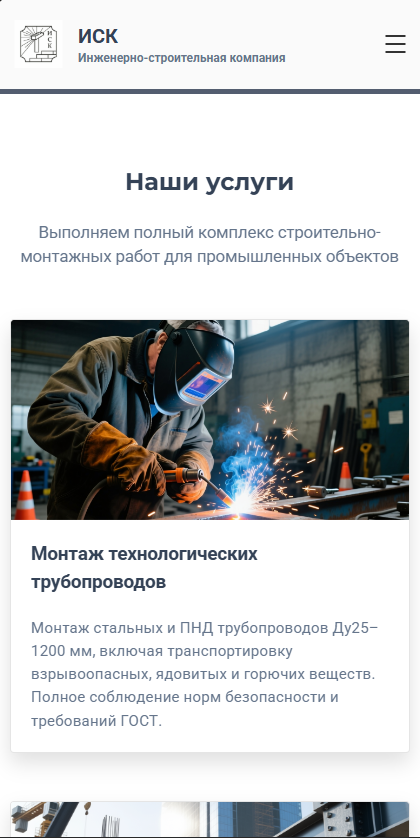

# ИСК - Инженерно-строительная компания

Современный корпоративный сайт для инженерно-строительной компании с адаптивным дизайном и удобным интерфейсом.

## Скриншоты

### Главная страница

*Главная страница с основным предложением и преимуществами компании*

### Страница услуг

*Каталог услуг компании*

### Страница реализованных проектов

*Выполненные проекты*

### Контакты

*Контактная информация и форма обратной связи*

### Мобильная версия

*Адаптивная версия для мобильных устройств*

## Возможности

- ✅ **Адаптивный дизайн** - корректное отображение на всех устройствах
- ✅ **Современный UI/UX** - интуитивно понятный интерфейс
- ✅ **Форма обратной связи** - быстрая связь с клиентами
- ✅ **Оптимизация** - быстрая загрузка страниц
- ✅ **SEO-готовность** - базовая оптимизация для поисковых систем

## Технологический стек

- **HTML5** - семантическая разметка
- **CSS3** - стилизация и анимации
- **JavaScript** - интерактивность

## Ссылка на сайт

https://isk-web.vercel.app